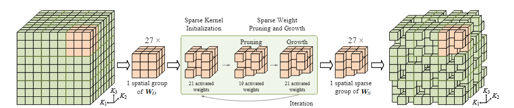

[](https://arxiv.org/abs/2403.15173) [](https://opensource.org/licenses/MIT) [](https://badges.toozhao.com/stats/01JP1PZG7G674A3FZB59CGSHYV "Get your own page views count badge on badges.toozhao.com") [](https://github.com/FengZicai/LSK3DNet)

[](https://paperswithcode.com/sota/3d-semantic-segmentation-on-semantickitti?p=lsk3dnet-towards-effective-and-efficient-3d)

[](https://paperswithcode.com/sota/lidar-semantic-segmentation-on-nuscenes?p=lsk3dnet-towards-effective-and-efficient-3d)

[](https://paperswithcode.com/sota/semantic-segmentation-on-scannet?p=lsk3dnet-towards-effective-and-efficient-3d)

[](https://paperswithcode.com/sota/3d-semantic-segmentation-on-scannet200?p=lsk3dnet-towards-effective-and-efficient-3d)


---

# LSK3DNet: Towards Effective and Efficient 3D Perception with Large Sparse Kernels



>[LSK3DNet: Towards Effective and Efficient 3D Perception with Large Sparse Kernels](https://arxiv.org/abs/2403.15173) <br>
>[Tuo Feng](https://orcid.org/0000-0001-5882-3315), [Wenguan Wang](https://sites.google.com/view/wenguanwang), [Fan Ma](https://flowerfan.site/), [Yi Yang](https://scholar.google.com/citations?hl=zh-CN&user=RMSuNFwAAAAJ&view_op=list_works)
>

This is the official implementation of "LSK3DNet: Towards Effective and Efficient 3D Perception with Large Sparse Kernels" (Accepted at CVPR 2024).

---

## Abstract

Autonomous systems need to process large-scale, sparse, and irregular point clouds with limited compute resources. Consequently, it is essential to develop LiDAR perception methods that are both efficient and effective. Although naively enlarging 3D kernel size can enhance performance, it will also lead to a cubically-increasing overhead. Therefore, it is crucial to develop streamlined 3D large kernel designs that eliminate redundant weights and work effectively with larger kernels. In this paper, we propose an efficient and effective Large Sparse Kernel 3D Neural Network (LSK3DNet) that leverages dynamic pruning to amplify the 3D kernel size. Our method comprises two core components: Spatial-wise Dynamic Sparsity (SDS) and Channel-wise Weight Selection (CWS). SDS dynamically prunes and regrows volumetric weights from the beginning to learn a large sparse 3D kernel. It not only boosts performance but also significantly reduces model size and computational cost. Moreover, CWS selects the most important channels for 3D convolution during training and subsequently prunes the redundant channels to accelerate inference for 3D vision tasks. We demonstrate the effectiveness of LSK3DNet on three benchmark datasets and five tracks compared with classical models and large kernel designs. Notably, LSK3DNet achieves the state-of-the-art performance on SemanticKITTI (i.e., 75.6% on single-scan and 63.4% on multi-scan), with roughly 40% model size reduction and 60% computing operations reduction compared to the naive large 3D kernel model.

---

## Table of Contents
1. [Project Structure](#project-structure)
2. [Installation](#installation)
3. [Data Preparation](#data-preparation)
4. [Training](#training)
5. [Testing](#testing)
6. [Model Zoo](#model-zoo)
7. [Acknowledgements](#acknowledgements)
8. [License](#license)

---

## Project Structure

Below is an overview of the key folders and scripts:

```
.
├── builder/                # Scripts to build or initialize models
├── c_utils/                # C++ library for fast generating of normal and range images
├── config/                 # Configuration files (.yaml) for training/testing
├── dataloader/             # Data loading scripts
├── network/                # Neural network architectures
├── utils/                  # Utility functions
├── test_skitti.py          # Script to test
├── train_skitti.py         # Main training script
├── test_nusc.py            # Script to test on the nuScenes dataset
├── train_nusc.py           # Training script for nuScenes
└── README.md               # This README file
```

---

## Installation

### Requirements
- **Python 3.7+**  
- **PyTorch >= 1.11.0**  
- **c_gen_normal_map**： refer to c_utils/README.md for details

Use the following command to install libraries:
  ```bash
  pip install -r requirements.txt
  ```

---

## Data Preparation

### SemanticKITTI
1. Download [SemanticKITTI data](http://semantic-kitti.org/dataset.html).  
2. Extract them into `./dataset/SemanticKitti/`.

**Example folder structure**:
```
./dataset/SemanticKitti/
   └── sequences/
       ├── 00/
       │   ├── velodyne/    # .bin files
       │   ├── labels/      # .label files
       │   └── calib.txt
       ├── 08/              # validation
       ├── 11/              # testing
       └── ...
```

### NuScenes
1. Download the Full dataset (v1.0) from [NuScenes](https://www.nuscenes.org/) with lidarseg annotations.  
2. Extract everything to `./dataset/nuscenes/`.

**Example folder structure**:
```
./dataset/nuscenes/
   ├── v1.0-trainval
   ├── samples
   ├── sweeps
   ├── maps
   ├── lidarseg
   └── ...
```

---

## Training

  ```bash
  CUDA_VISIBLE_DEVICES=0,1 python train_xxxx.py | tee output/opensource_ks9_64.txt
  ```

## Testing

Use the corresponding test scripts to evaluate the trained models:

  ```bash
  CUDA_VISIBLE_DEVICES=0,1 python test_XXXX.py | tee output/opensource_test.txt
  ```
---

## Model Zoo

You can find our pretrained models here. 

| Model                     | mIoU (TTA) | Download |
|:-------------------------:|:----------:|:------:|
| **LSK3DNet (SemanticKITTI val)**| 70.2%      | [Pretrained model](https://1drv.ms/f/c/51047963251c4cf8/Ep3MBBEiAXtHvWaZT9Q7rH0BrA9ucMgYugeGxwYgxfcNng?e=CjMxAc)   |
| **LSK3DNet (NuScenes val)**     | 80.1%      | [Pretrained model](https://1drv.ms/f/c/51047963251c4cf8/Ep3MBBEiAXtHvWaZT9Q7rH0BrA9ucMgYugeGxwYgxfcNng?e=CjMxAc)    |

The SemanticKITTI benchmark test results are accessible at [this link](https://codalab.lisn.upsaclay.fr/competitions/6280#results) under the account **Cluster3DSeg_**, while the ScanNet test results can be viewed at [this link](https://kaldir.vc.in.tum.de/scannet_benchmark/semantic_label_3d) under the method entry **LSK3DNet**.

---

## Acknowledgements

Our work references or builds upon:
- [**2DPASS**](https://github.com/yanx27/2DPASS)  
- [**SPVNAS**](https://github.com/mit-han-lab/spvnas)  
- [**Cylinder3D**](https://github.com/xinge008/Cylinder3D)  
- [**SPCONV**](https://github.com/traveller59/spconv)
- [**LargeKernel3D**](https://github.com/dvlab-research/LargeKernel3D)
- [**spconv-plus**](https://github.com/dvlab-research/spconv-plus)
- [**SLaK**](https://github.com/VITA-Group/SLaK)
- [**range-mcl**](https://github.com/PRBonn/range-mcl)

We thank the authors for their open-source contributions.

---

## License

This project is released under the [MIT License](LICENSE).  

---

## Citation

If you find the code useful in your research, please consider citing our [paper](https://openaccess.thecvf.com/content/CVPR2024/papers/Feng_LSK3DNet_Towards_Effective_and_Efficient_3D_Perception_with_Large_Sparse_CVPR_2024_paper.pdf):

```BibTeX
@inproceedings{feng2024lsk3dnet,
  title={Lsk3dnet: Towards effective and efficient 3d perception with large sparse kernels},
  author={Feng, Tuo and Wang, Wenguan and Ma, Fan and Yang, Yi},
  booktitle={Proceedings of the IEEE/CVF Conference on Computer Vision and Pattern Recognition},
  pages={14916--14927},
  year={2024}
}
```

**Contact**  
Any comments, please email: feng.tuo@student.uts.edu.au. 

